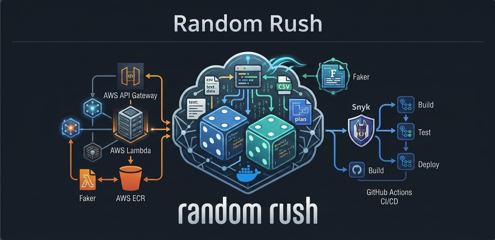
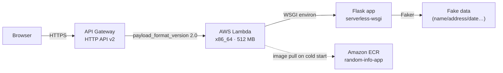
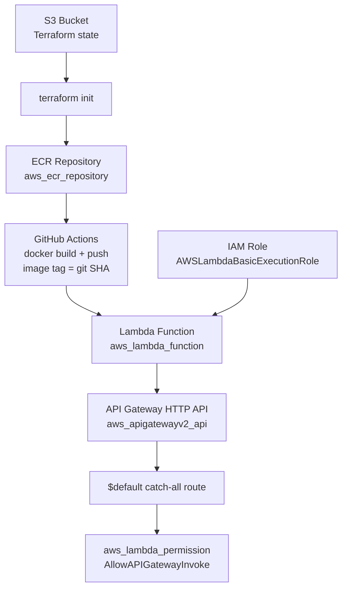

[](https://www.python.org/)
[](https://flask.palletsprojects.com/)
[](https://faker.readthedocs.io/)
[](https://www.terraform.io/)
[](https://aws.amazon.com/lambda/)
[](https://aws.amazon.com/ecr/)
[](https://aws.amazon.com/api-gateway/)
[](https://www.docker.com/)
[](https://github.com/features/actions)
[](https://snyk.io/)


## 📌 Overview

**Random Rush** is a serverless web application that generates random fake data across multiple categories using the [Faker](https://faker.readthedocs.io/) library. Select a category, choose how many results you need, pick a locale, and download everything as a CSV — all from a browser, no setup required.

🔗 **Live app:** [https://i6ie3zeuy7.execute-api.us-east-1.amazonaws.com](https://i6ie3zeuy7.execute-api.us-east-1.amazonaws.com)

---

## ✨ Features

- 🎲 Generate random data for: `name`, `address`, `date`, `text`, `credit_card`, `email`, `phone_number`, `colors`, `company`
- 🌍 Locale support for internationalized fake data
- 📥 Download results as a CSV file
- ☁️ Fully serverless — no servers to manage
- 🔒 Automated security scanning with Snyk on every push
- 🧪 Automated test suite with pytest and pytest-flask
- 🚀 Full CI/CD pipeline via GitHub Actions — push to `main` builds, tests, and deploys automatically

---

## 🧱 Tech Stack

| Layer | Technology |
|---|---|
| 🐍 Application | Python 3.11, Flask 3.1.3, Faker 40.19.1 |
| 🔌 Lambda adapter | serverless-wsgi 3.0.4 (WSGI, API GW v1 + v2) |
| 🐳 Containerization | Docker (`public.ecr.aws/lambda/python:3.11`, `linux/amd64`) |
| 📦 Container Registry | Amazon ECR (`scan_on_push = true`) |
| ⚡ Compute | AWS Lambda — container image, `x86_64`, 512 MB, 30s timeout |
| 🌐 HTTP Endpoint | Amazon API Gateway HTTP API (v2), payload format 2.0 |
| 🔐 IAM | AWS IAM role + `AWSLambdaBasicExecutionRole`, OIDC for CI |
| 🏗️ Infrastructure as Code | Terraform >= 1.0 |
| 🗄️ State Backend | S3 with native S3 locking (`use_lockfile = true`) |
| 🔄 CI/CD | GitHub Actions — Snyk scan → pytest → ECR push → Terraform apply |
| 🧪 Testing | pytest 8.3.5 + pytest-flask 1.3.0 |

---

## 🏛️ Architecture

### Request flow



### Infrastructure dependency graph



### CI/CD pipeline

```mermaid
flowchart LR
    Push["git push → main"] --> CI_Job["ci job\nubuntu-latest"]
    CI_Job --> Deps["pip install\nrequirements.txt"]
    Deps --> Snyk1["snyk test\ndependency scan"]
    Snyk1 --> Snyk2["snyk code test\nSAST scan"]
    Snyk2 --> Tests["pytest tests/ -v"]
    Tests --> Deploy_Job["deploy job\n(needs: ci)"]
    Deploy_Job --> OIDC["OIDC\nconfigure-aws-credentials"]
    OIDC --> ECR_Login["amazon-ecr-login"]
    ECR_Login --> Build["docker build\n--platform linux/amd64\ntag = github.sha"]
    Build --> Push_ECR["docker push ECR"]
    Push_ECR --> Lambda_Update["aws lambda\nupdate-function-code"]
    Lambda_Update --> TF_Init["terraform init\n-backend-config bucket"]
    TF_Init --> TF_Plan["terraform plan\n-target scoped"]
    TF_Plan --> TF_Apply["terraform apply\n-auto-approve"]
```



---

## 🗂️ Project Structure

```
random_info/
├── application.py          # Flask app + Lambda handler (serverless_wsgi)
├── requirements.txt        # Pinned dependencies
├── Dockerfile              # Lambda container image (python:3.11)
├── conftest.py             # pytest path setup
├── tests/
│   └── test_application.py # Route-level tests (pytest-flask)
├── templates/              # Jinja2 HTML templates per category
├── static/                 # CSS, images
├── .github/
│   └── workflows/
│       └── main.yml        # GitHub Actions CI/CD pipeline
├── Jenkinsfile             # Jenkins pipeline stub
└── infra/
    ├── main.tf             # Root module — wires all child modules
    ├── variable.tf         # Input variables
    ├── backend.tf          # S3 backend with native locking
    ├── output.tf           # api_endpoint output
    ├── bootstrap/          # One-time S3 state bucket creation
    └── modules/
        ├── ecr/            # ECR repo (docker build commented out — CI owns this)
        ├── iam/            # Lambda execution role
        ├── lambda/         # Lambda function (container image)
        └── apigateway/     # HTTP API v2, integration, route, stage, permission
```

---

## 🌐 Application Routes

| Method | Route | Description |
|---|---|---|
| `GET` | `/` | 🏠 Landing page — category list |
| `GET` | `/allow/<category>` | 🗂️ Selection page for a category |
| `GET` | `/allow/<category>/<count>/<locale>` | 🎲 Generate `count` items using Faker locale |
| `GET` | `/allow/<category>/<count>/<start>/<end>/` | 📅 Generate random dates between two ISO dates |
| `POST` | `/download/` | 📥 Download current results as CSV (JSON body → in-memory `StringIO`) |

### Handler entrypoint

`application.py` exposes two entry points:

```python
# Lambda invocation (via API Gateway)
def handler(event, context):
    return serverless_wsgi.handle_request(application, event, context)

# Local development
if __name__ == '__main__':
    application.run(host="0.0.0.0", port=5000)
```

---

## 🚀 CI/CD Pipeline (GitHub Actions)

The pipeline in `.github/workflows/main.yml` triggers on every push to `main` and runs two sequential jobs.

### `ci` job — quality gates

| Step | Tool | Purpose |
|---|---|---|
| Install deps | pip | `requirements.txt` |
| Dependency scan | `snyk test` | Known CVEs in packages |
| SAST scan | `snyk code test` | Source-code security issues |
| Unit tests | `pytest tests/ -v` | All route-level assertions |

### `deploy` job — release (requires `ci` to pass)

| Step | Action / Command | Notes |
|---|---|---|
| AWS auth | `configure-aws-credentials@v4` | OIDC — no static secrets |
| ECR login | `amazon-ecr-login@v2` | Temporary token |
| Docker build | `--platform linux/amd64 --provenance=false` | Matches Lambda `x86_64` |
| Docker push | ECR — tag = `github.sha` | Immutable, traceable tag |
| Lambda update | `aws lambda update-function-code` | Hot-swaps image immediately |
| Terraform init | `-backend-config` from secrets | S3 state bucket |
| Terraform plan | `-target` scoped (no ECR build resource) | Infra drift detection |
| Terraform apply | `-auto-approve` | Applies infrastructure changes |

> **Design note:** Docker build and push happen in the GitHub Actions runner, **not** via Terraform `local-exec`. The ECR module's `null_resource` is commented out. Terraform manages infrastructure state; CI manages the image lifecycle. This is the correct separation of concerns for a production pipeline.

### Required secrets

| Secret | Description |
|---|---|
| `AWS_ROLE_ARN` | IAM role ARN assumed via OIDC |
| `TF_STATE_BUCKET` | S3 bucket holding Terraform state |
| `SNYK_TOKEN` | Snyk API token |
| `SNYK_ORG` | Snyk organisation slug |

---

## 📐 Terraform Module Reference

| Module | Resources | Notes |
|---|---|---|
| `modules/ecr` | `aws_ecr_repository` | `scan_on_push = true`, `force_delete = true`; docker build **removed** — managed by CI |
| `modules/iam` | `aws_iam_role`, `aws_iam_role_policy_attachment` | `AWSLambdaBasicExecutionRole` |
| `modules/lambda` | `aws_lambda_function` | `x86_64`, 512 MB, 30s timeout, `image_tag = github.sha` in CI |
| `modules/apigateway` | `aws_apigatewayv2_api/integration/route/stage`, `aws_lambda_permission` | HTTP API v2, `payload_format_version = "2.0"`, `$default` catch-all |

### Key variables (`infra/variable.tf`)

| Variable | Default | CI override | Description |
|---|---|---|---|
| `aws_region` | `us-east-1` | — | AWS region |
| `ecr_repo_name` | `random-info-app` | — | ECR repository name |
| `image_tag` | `latest` | `github.sha` | Docker image tag |
| `lambda_name` | `random-info-web-adapter` | — | Lambda function name |

---

## 🚀 Manual Infrastructure Deployment

Use this flow for first-time setup or when running outside CI.

### Prerequisites

- [Terraform](https://developer.hashicorp.com/terraform/install) >= 1.0
- [Docker](https://docs.docker.com/get-docker/)
- [AWS CLI](https://docs.aws.amazon.com/cli/latest/userguide/install-cliv2.html) configured with permissions for ECR, Lambda, IAM, and API Gateway

### 1. Create the S3 state backend

```bash
cd infra/bootstrap
terraform init
terraform apply -var='bucket_name=unique-bucket-name' -auto-approve
```

Note the `bucket_name` output — you will need it in the next step.

### 2. Build and push the Docker image manually

```bash
ACCOUNT=$(aws sts get-caller-identity --query Account --output text)
REGION=us-east-1
REPO=random-info-app

aws ecr get-login-password --region $REGION \
  | docker login --username AWS --password-stdin $ACCOUNT.dkr.ecr.$REGION.amazonaws.com

docker build --platform linux/amd64 --provenance=false --output type=docker \
  -t $ACCOUNT.dkr.ecr.$REGION.amazonaws.com/$REPO:latest .

docker push $ACCOUNT.dkr.ecr.$REGION.amazonaws.com/$REPO:latest
```

### 3. Deploy the full stack

```bash
cd infra
terraform init \
  -backend-config="bucket=BUCKET_NAME" \
  -backend-config="region=us-east-1"

terraform apply \
  -var='aws_region=us-east-1' \
  -var='image_tag=latest' \
  -auto-approve
```

The `api_endpoint` output is the live URL. 🎉

### Tear down

```bash
terraform destroy -var='aws_region=us-east-1' -auto-approve
```

> **Note:** ECR has `force_delete = true`, so the repository and all images are deleted on `terraform destroy`.

---

## 🧪 Running Tests 

```bash
pytest tests/ -v
```

The test suite covers all routes:

| Test | What it verifies |
|---|---|
| `test_index` | `GET /` returns 200 |
| `test_valid_selection` | `GET /allow/name` returns 200 |
| `test_invalid_selection` | Unknown category returns `"Wrong selection"` |
| `test_results` | `GET /allow/name/3/en_US` generates 3 items |
| `test_results_between` | `GET /allow/date/3/2020-01-01/2021-01-01/` generates 3 dates |
| `test_download` | `POST /download/` returns `text/csv` with status 200 |
| `test_download_invalid` | Invalid body returns 400 |

---

## 🔥 Engineering Challenges & Solutions

These are non-trivial problems encountered during the build, documented as a reference.

---

### 1. Lambda container architecture mismatch

The ECR module built the image with `--platform linux/amd64`, but Lambda was configured with `architectures = ["arm64"]`. Lambda silently failed to initialize — no useful error message. Fix: align both to `x86_64` / `linux/amd64`.

---

### 2. Dockerfile ENTRYPOINT conflict with the Lambda base image

The original Dockerfile overrode `ENTRYPOINT` with `python3 -m awslambdaric` and re-installed `awslambdaric`. The AWS Lambda Python base image (`public.ecr.aws/lambda/python:3.11`) already ships with the Lambda Runtime Interface Client and sets its own entrypoint — overriding it caused a silent startup failure. Fix: remove the custom `ENTRYPOINT` entirely; keep only `CMD ["application.handler"]`.

---

### 3. Dead dependency: `apigw-wsgi` not on PyPI

`apigw-wsgi==3.1.1` was in `requirements.txt` but does not exist on PyPI for `linux/amd64` / Python 3.11. The build failed silently on first run because a cached image was pushed. The failure only surfaced on a clean rebuild. Fix: replaced with `serverless-wsgi==3.0.4`.

---

### 4. WSGI vs ASGI adapter incompatibility (`mangum`)

`mangum` is an **ASGI** adapter. Flask is a **WSGI** framework. Passing a Flask app to `mangum` raised:

```
TypeError: Flask.__call__() takes 3 positional arguments but 4 were given
```

ASGI calls apps with 3 args (`scope`, `receive`, `send`); WSGI with 2 (`environ`, `start_response`). Fix: `serverless-wsgi`, which correctly implements the WSGI protocol.

---

### 5. API Gateway HTTP API v2 event format

`aws-wsgi` only handles the API Gateway **v1** (REST API) event format (`httpMethod` at the top level). API Gateway **HTTP API v2** uses `requestContext.http.method`. This caused `KeyError: 'httpMethod'` on every request. Fix: `serverless-wsgi` handles both v1 and v2 payload formats transparently.

---

### 6. `send_file` fails inside Lambda

The download route wrote to `/tmp/output.csv` and returned it via `send_file`. Behind a WSGI adapter in Lambda, the adapter cannot stream a file through the API Gateway response envelope. Fix: switched to `io.StringIO` — the CSV is built entirely in memory and returned as a `Flask.Response` object. No disk I/O.

---

### 7. API Gateway rejecting URL-encoded JSON in path parameters

The download route originally passed CSV data as URL-encoded JSON in the path (`/download/<params>/`). API Gateway HTTP API rejected or misrouted requests when the encoded payload contained `%5B`, `%7B`, `%22` — Lambda was never invoked and the 404 came from the gateway itself. Fix: `POST /download/` with a JSON body — the correct pattern for structured data.

---

### 8. Terraform `null_resource` does not re-run on code changes

Terraform tracks `null_resource` by internal ID, not file content. After modifying application code, `terraform apply` reported "No changes." Fix: the `null_resource` docker build is now **commented out entirely** — the CI pipeline owns the image build and push. Terraform manages only infrastructure resources. This is the correct long-term pattern.

---

### 9. Terraform `local-exec` builds in CI cause image tagging collisions

When Terraform managed the docker build with `image_tag = "latest"`, concurrent pipeline runs could race on the same mutable tag. Fix: CI tags images with `github.sha` (immutable, commit-traceable) and passes it as `-var="image_tag=${{ github.sha }}"`. Each Lambda deployment points to an exact, auditable image digest.

---

## 📝 Operational Notes

- **Architecture alignment:** Lambda is `x86_64`; Docker build uses `--platform linux/amd64`. These must always match.
- **Image tagging:** CI uses `github.sha` for immutable, auditable tags. The `latest` default is for local/manual use only.
- **State locking:** The S3 backend uses `use_lockfile = true` (Terraform >= 1.10 native locking — no DynamoDB table needed).
- **Terraform targeting in CI:** The pipeline uses `-target` to exclude `module.ecr.null_resource.docker_build_and_push` (which is commented out). If you add new Terraform resources, update the `-target` list or remove targeting to apply all.
- **OIDC authentication:** The deploy job uses GitHub Actions OIDC (`id-token: write`) to assume an IAM role. No long-lived AWS credentials are stored as secrets.
- **ECR image scanning:** `scan_on_push = true` on the ECR repository — check the AWS console for vulnerability findings after each push.
- **Local development:** `python application.py` starts Flask on port 5000. No Lambda or API Gateway needed locally.
